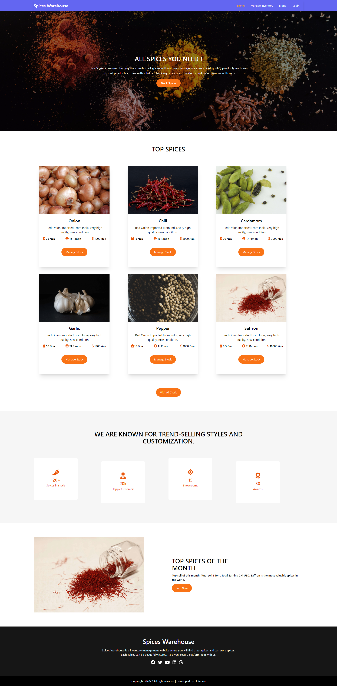
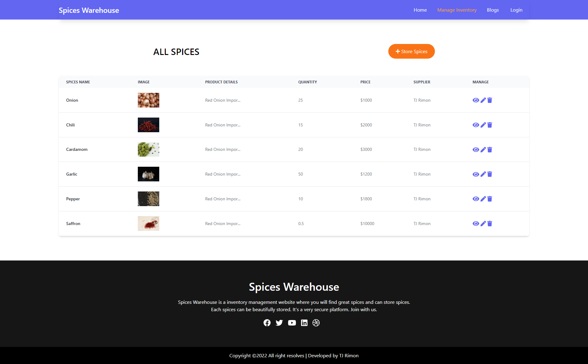

# Spices warehouse | Inventory Management 

Live Link: [Spices Warehouse](https://spices-warehouse.web.app/).

## Documentation

* This is a # Spices warehouse website.
* Version : 1.000
* In this website we can store spices
* In the blog section some of question and answer available. 
* We can manage,add,update,delete spices item
* Language used in this project
    * HTML
    * CSS
    * JavaScript
* Framework and Library used in this project:     
    * React 
    * React Router
    * Axios
    * Tailwind Css framework 
    * Firebase
    * Firebase hosting
    * HeroIcon 

### Home Page

### Inventory Page
